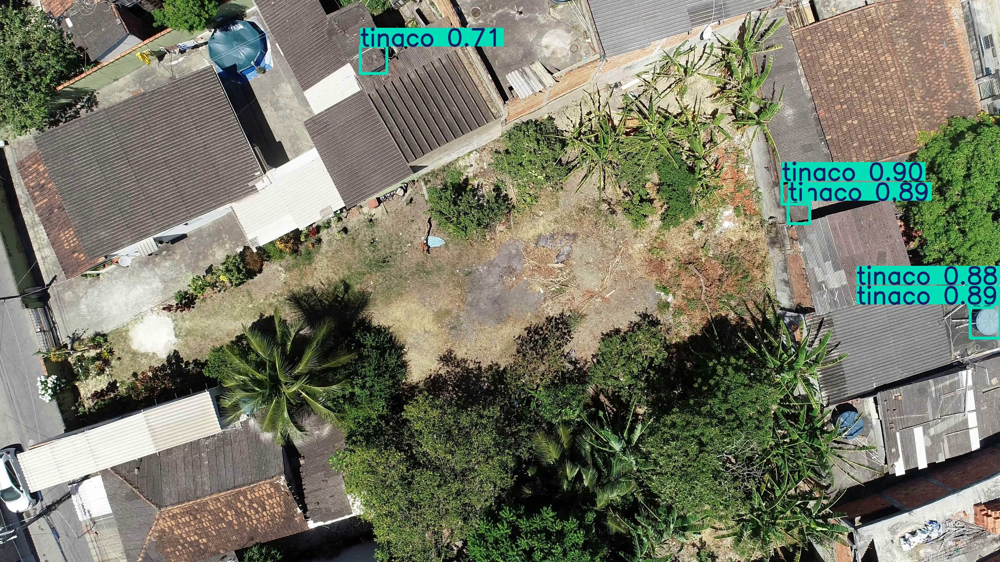
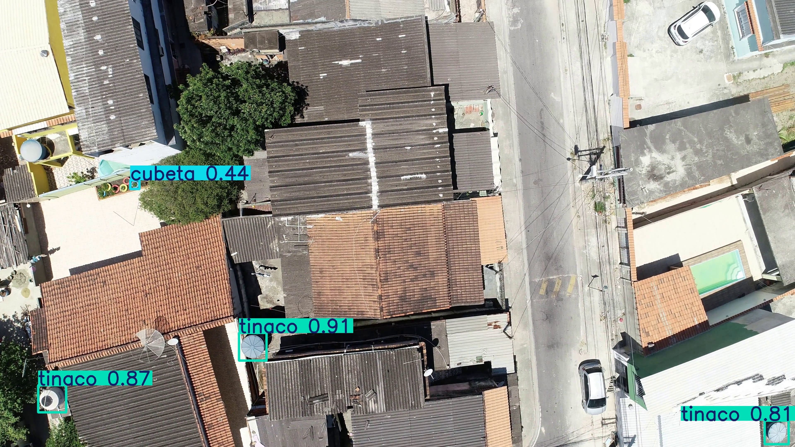
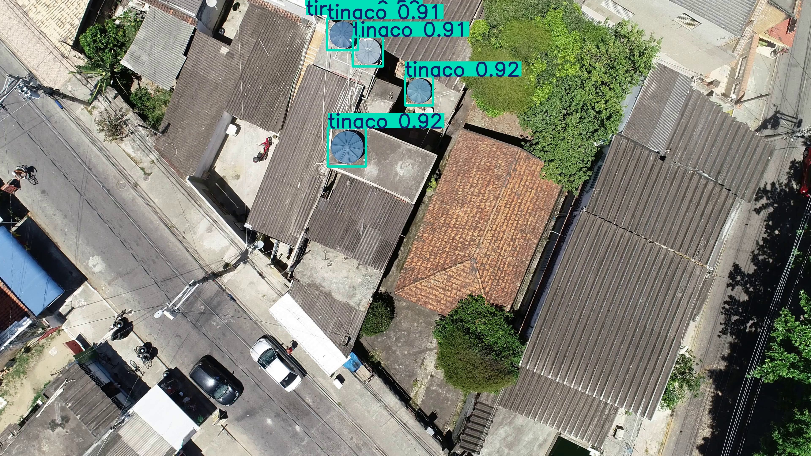
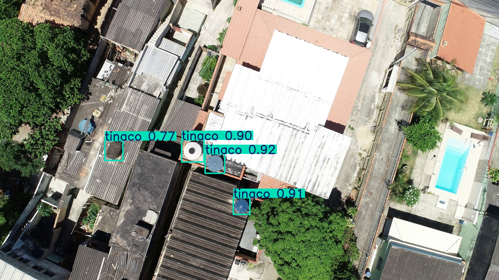

# Detección de Criaderos de Mosquitos con YOLO y Data Augmentation

## Descripción

Este proyecto propone un sistema de detección automática de potenciales criaderos de mosquitos en imágenes aéreas capturadas mediante drones, utilizando modelos de detección de objetos basados en YOLO.

El objetivo principal es evaluar el impacto de estrategias de aumentación de datos orientadas a clases minoritarias sobre el desempeño de modelos de detección, comparando un modelo base entrenado con imágenes originales contra un modelo optimizado utilizando técnicas de Data Augmentation.

El proyecto fue desarrollado como parte de la Maestría en Cómputo Estadístico y constituye una etapa inicial dentro de una investigación orientada al monitoreo automatizado de criaderos mediante visión por computadora.

---

# Objetivo del Proyecto

Evaluar el impacto de técnicas de aumentación de datos en la detección de potenciales criaderos de mosquitos presentes en imágenes aéreas.

Para ello se entrenaron dos modelos:

1. **Modelo base (sin augmentación)**.
2. **Modelo optimizado utilizando estrategias de Data Augmentation orientadas a clases minoritarias**.

La comparación se realizó utilizando métricas estándar de detección de objetos:

* Precision
* Recall
* mAP@50
* mAP@50-95

---

# Tecnologías Utilizadas

* Python
* Ultralytics YOLO
* OpenCV
* NumPy
* Albumentations
* Deep Learning
* Computer Vision
* Object Detection

---

# Estructura del Repositorio

```text
mosquito-breeding-site-detection/
│
├── README.md
├── requirements.txt
│
├── src/
│   ├── split_yolo_dataset.py
│   ├── train_yolo12s.py
│   ├── train_yolo12_optimized.py
│   ├── copy_paste.py
│   └── predict_examples.py
│
├── weights/
│   ├── best.pt
│   └── last.pt
│
├── README_assets/
│   └── imágenes utilizadas en la documentación
│
└── configs/
    └── data.yaml
```

---

# Pipeline del Proyecto

## 1. División del Dataset

**Script:** `split_yolo_dataset.py`

Este script organiza el dataset en el formato requerido por YOLO:

* División entrenamiento / validación.
* Organización de imágenes y etiquetas.
* Verificación de consistencia entre imágenes y anotaciones.

---

## 2. Entrenamiento del Modelo Base

**Script:** `train_yolo12s.py`

Entrenamiento del modelo base utilizando únicamente las imágenes originales del dataset.

Este modelo sirve como referencia para evaluar el impacto de las estrategias de aumentación de datos.

---

## 3. Aumentación de Datos

**Script:** `copy_paste.py`

Implementación de una estrategia Copy-Paste Augmentation para incrementar la presencia de clases minoritarias.

Las nuevas muestras generadas buscan mejorar la capacidad del modelo para detectar objetos poco representados dentro del conjunto de entrenamiento.

---

## 4. Entrenamiento del Modelo Optimizado

**Script:** `train_yolo12_optimized.py`

Entrenamiento de un segundo modelo utilizando el conjunto de datos aumentado.

Este modelo incorpora ejemplos adicionales generados mediante augmentación para mejorar el desempeño en clases minoritarias.

---

## 5. Inferencia sobre Nuevos Vuelos

**Script:** `predict_examples.py`

Permite cargar el modelo entrenado y realizar inferencia sobre imágenes provenientes de vuelos distintos a los utilizados durante el entrenamiento.

Las detecciones generadas son utilizadas para evaluar cualitativamente la capacidad de generalización del modelo.

---

# Resultados de Inferencia

A continuación se muestran ejemplos de detecciones realizadas sobre imágenes provenientes de vuelos distintos a los utilizados durante el entrenamiento.

## Ejemplo 1

<table>
<tr>
<td align="center">
<b>Imagen Original</b><br>

</td>

<td align="center">
<b>Detecciones del Modelo</b><br>

</td>
</tr>
</table>

## Ejemplo 2

<table>
<tr>
<td align="center">
<b>Imagen Original</b><br>

</td>

<td align="center">
<b>Detecciones del Modelo</b><br>

</td>
</tr>
</table>

## Ejemplo 3

<table>
<tr>
<td align="center">
<b>Imagen Original</b><br>

</td>

<td align="center">
<b>Detecciones del Modelo</b><br>

</td>
</tr>
</table>

## Ejemplo 4

<table>
<tr>
<td align="center">
<b>Imagen Original</b><br>

</td>

<td align="center">
<b>Detecciones del Modelo</b><br>

</td>
</tr>
</table>

---

# Modelos Entrenados

El repositorio incluye los pesos finales obtenidos durante el entrenamiento:

* `weights/best.pt`
* `weights/last.pt`

Estos modelos pueden utilizarse directamente para realizar inferencia sobre nuevas imágenes.

---

# Instalación

Clonar el repositorio:

```bash
git clone https://github.com/javieralvarado-web/mosquito-breeding-site-detection.git
cd mosquito-breeding-site-detection
```

Instalar dependencias:

```bash
pip install -r requirements.txt
```

---

# Instalación de PyTorch

El archivo `requirements.txt` no incluye PyTorch debido a que la instalación depende del hardware disponible y de la versión de CUDA utilizada.

### CUDA 12.1

```bash
pip install torch torchvision --index-url https://download.pytorch.org/whl/cu121
```

### CUDA 11.8

```bash
pip install torch torchvision --index-url https://download.pytorch.org/whl/cu118
```

---

# Ejemplo de Inferencia

```bash
python src/predict_examples.py
```

El script cargará el modelo entrenado y generará las detecciones correspondientes sobre las imágenes especificadas.

---

# Trabajo Futuro

* Integración con sistemas de georreferenciación.
* Seguimiento temporal de objetos mediante tracking.
* Estimación automática de coordenadas GPS de criaderos detectados.
* Evaluación sobre conjuntos de prueba independientes.
* Integración dentro de un pipeline completo de monitoreo mediante drones.

---

# Autor

**Javier Alvarado**

Maestría en Cómputo Estadístico

Centro de Investigación en Matemáticas (CIMAT)
